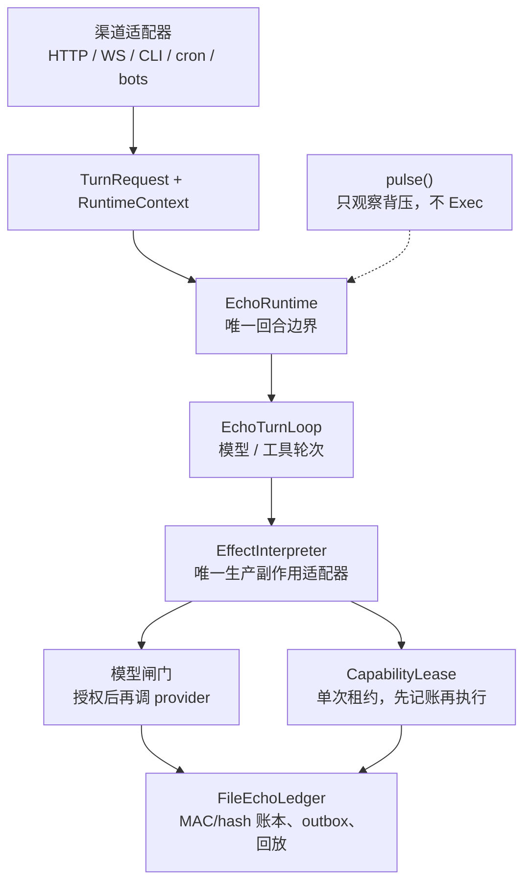

# Echo

Echo 是本地个人 Agent 的**核心回合架构**：模型、工具、附件、副作用只从这一条边界进去。

本仓库只介绍这个模型。可运行的产品在 [titan-agent](https://github.com/JiangSkirk/titan-agent)；旁路保安在 [orin](https://github.com/JiangSkirk/orin)。

[English](#echo-core-architecture)

## 一句话

不是聊天机器人，也不是又一套 Agent 框架。Echo 规定：**一次回合只有一个权威入口**，缺闸门就停，不靠第二套 loop 救活。

## 回合怎么走

1. 适配器组好不可变的 `TurnRequest` 和完整的 `RuntimeContext`（product / owner / session / run / workspace）。
2. `run_echo_turn()` 只进 `EchoRuntime`。附件校验、确定性准入、租户绑定都在这里。
3. `EchoTurnLoop` 管对话状态、上下文裁剪、模型/工具轮次、取消与终态。
4. 模型步变成 `ModelEffect`，工具步变成 `ToolEffect`。**只有** `EffectInterpreter` 可以执行。
5. 模型：先过闸门再打 provider，回来再 finalize。
6. 工具：先签发并**消费**一张单次 `CapabilityLease`（绑定产品、owner、session、run、工具、参数、文件系统/网络授权、预算），再跑 handler。
7. `FileEchoLedger` 是唯一持久账本。不确定的不可逆效果进人工复核，不假装回滚。

`pulse()` 只观察背压（准入/调度），不调用模型、工具、文件或网络。

## 核心零件

| 零件 | 职责 |
|------|------|
| `EchoRuntime` | 唯一权威回合边界 |
| `EchoPulseRuntime` / `pulse()` | 确定性准入与背压，不 Exec |
| `EchoTurnLoop` | 模型/工具循环与终态 |
| `EffectInterpreter` | 唯一生产副作用出口 |
| `CapabilityLease` | 单次租约；消费先于 handler |
| `ScopeGate` | 把 product / session / run / 模型 / 消息 / 工具绑进许可 |
| `FileEchoLedger` | MAC/hash 链式 journal、outbox、收据、恢复 |

扩展规则：新渠道只组 `TurnRequest`，不另写 Agent loop；新模型走 router 合同，不能绕过模型回调；新工具只注册元数据，执行必须经过租约后的 `ToolEffect`。

## 本仓库有什么

- [docs/DEFAULT_ARCHITECTURE.md](docs/DEFAULT_ARCHITECTURE.md) — 默认路径
- [docs/ECHO_2_ARCHITECTURE.md](docs/ECHO_2_ARCHITECTURE.md) — 运行时组件
- [docs/ECHO_UNIFIED_EXECUTION_CONTRACT.md](docs/ECHO_UNIFIED_EXECUTION_CONTRACT.md) — 统一执行合同
- [docs/adr/0001-echo-ledger-boundary.md](docs/adr/0001-echo-ledger-boundary.md) — 账本边界 ADR

这里没有桌面、Host、bots、Fleet，也没有把 `js/echo` 整树搬过来。实现仍在产品仓。

## 明确不宣称

- Echo 不是对抗性模型的承重隔离；承重边界是 OS 沙箱。Echo 是授权与纵深。
- 默认没有第二套运行时。`off` / `shadow` 这类回滚开关 fail-closed。
- 本仓库是架构说明，不是 GitHub stable 发行。

MIT。见 [LICENSE](LICENSE)。

---

## Echo core architecture

Echo is the **turn architecture** for a local personal agent: models, tools, attachments, and side effects enter through one boundary.

This repository is that introduction. The runnable product is [titan-agent](https://github.com/JiangSkirk/titan-agent). The sidecar gate is [orin](https://github.com/JiangSkirk/orin).

One turn: adapter → `TurnRequest` → `EchoRuntime` → `EchoTurnLoop` → `EffectInterpreter` → gated model call or single-use `CapabilityLease` → `FileEchoLedger`. `pulse()` observes backpressure only; it does not Exec.

Fail closed. No second loop. No naked provider or tool-handler calls in normal operation.
