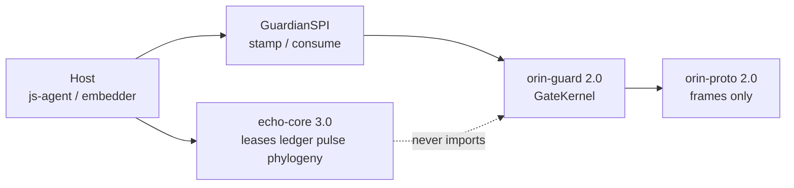

# Echo 3.0

Echo 3.0 is the **extracted kernel**: `echo-core`. Hosts (including
[titan-agent](https://github.com/JiangSkirk/titan-agent)) consume it. This
repository stays an architecture overview; it does not vendor the package
tree.

Implementation: `packages/echo-core` in titan-agent. Version **3.0.0**.
PyPI is not published. Install from that monorepo (`uv sync` or
`pip install ./packages/echo-core`).

## What changed vs Echo 2.0

Echo 2.0 is still the **turn model** (one `EchoRuntime`, leases, ledger,
`pulse()` observe-only). Echo 3.0 is that kernel **as a package**, with a
host-wired protection SPI and two-tier evolution.

Rules:

- `echo-core` has **zero** `js.*` imports and **must not** import `orin-guard`
  or `orin-proto`.
- Echo **proposes** effects. A Host binds `GuardianSPI`. `NullGuardian` is
  fail-closed (no ambient grants).
- Neutral taint / sink / lease vocabulary lives in `echo-core`. Policy stays
  in Orin.

## Two-tier phylogeny

Learning is an effect after a turn reaches terminal state, not a second Exec
loop. Polarity:

| Polarity | Auto-commit | Constraint |
|----------|-------------|------------|
| `tighten` | yes | Never grants new power |
| `note` | yes | `USER_TURN`-only taint |
| `widen` | **never** | Owner bind + eval gate + guardian stamp |

Eval gate and rollback have **no off switch**. Constitution prefixes
(`echo_core/capability`, `echo_core/ledger`, `orin_guard/`, `prompts/stable/`)
are not evolvable.

## Do not claim

- OS isolation remains the load-bearing boundary against an adversarial model.
- Stage C / `orin.enforce=true` as a product default: **not** claimed.
- Independent `pip install echo-core` from PyPI: **not** available.
- This repo is not a GitHub stable product tag.

See also [ADR 0009](adr/0009-echo-core-orin-guard-extraction.md) and
[ADR 0010](adr/0010-echo-two-tier-learning.md).
